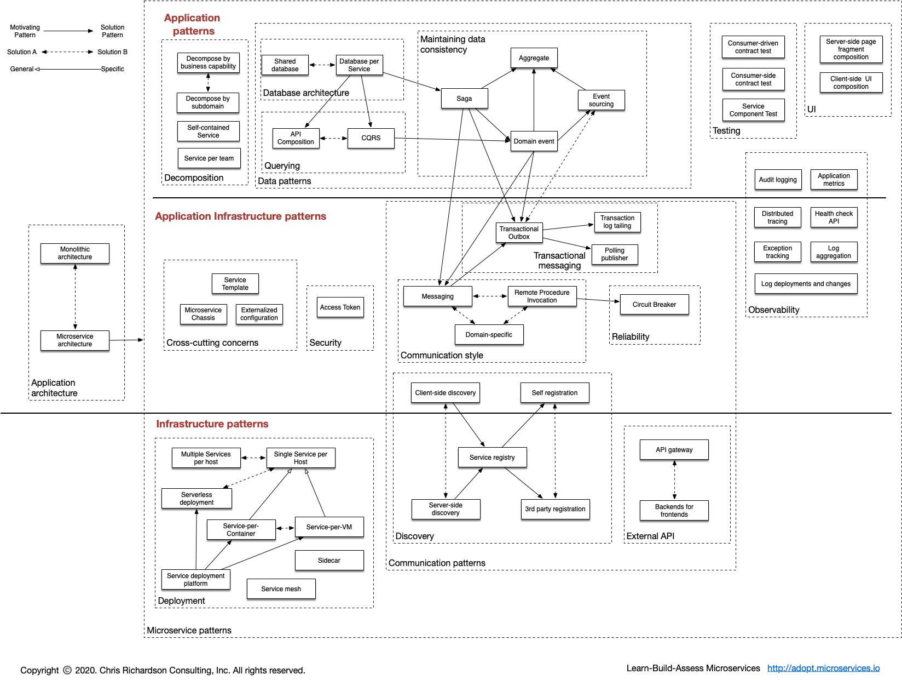
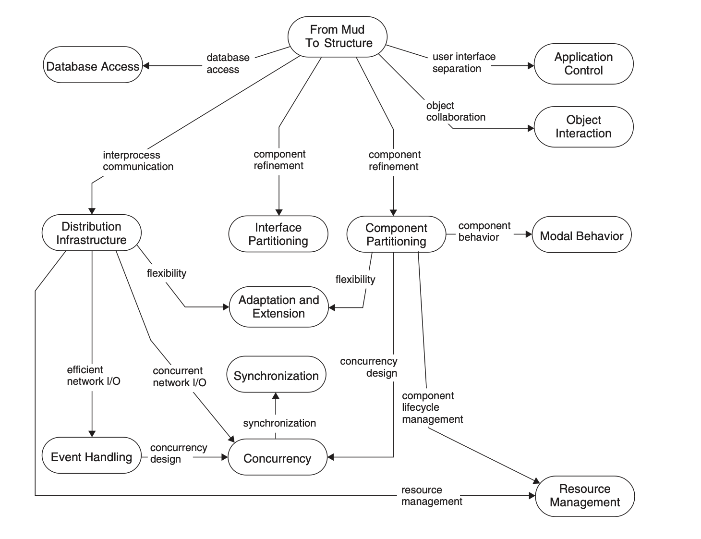
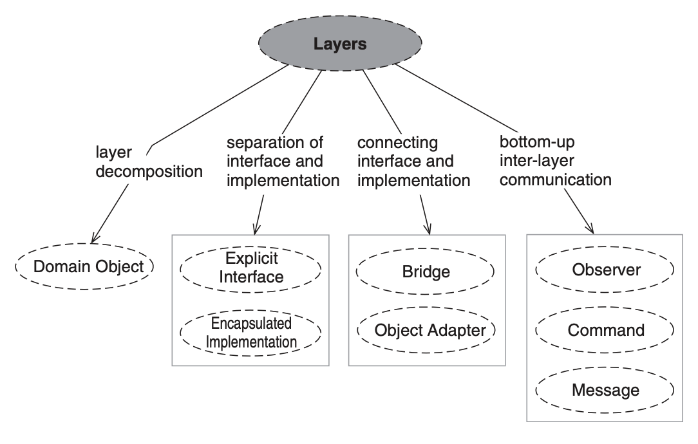

# pattern-languages
a collcetion of pattern langauges

## Domain

### MicroServices

from: "[A pattern language for microservices](https://microservices.io/patterns/)"

### Distributed Computing

from: "POSA 4"

Layer Architecture example

### MicroFrontend

Todo

## Books

### English

| Author      |  Name                                           |  Time     |
|----------|----------------------------------------------------|---------|
| Frank Buschmann / Douglas C.Schmidt / Keclin Henney | Pattern-Oriented Software Architecture Volume 4, A Pattern Language for Distributed Computing  | 2007 |
| Frank Buschmann / Kevlin Henney / Douglas C.Schmidt | Pattern-Oriented Software Architecture Volume 5, On Patterns and Pattern Languages | 2007 |

### Chinese

| 作者      |  名称                                               | 时间     |
|----------|----------------------------------------------------|---------|
| Frank Buschmann / Douglas C.Schmidt / Keclin Henney | 《面向模式的软件架构，卷 4：分布式计算的模式语言》 | 2010 |
| Frank Buschmann / Kevlin Henney / Douglas C.Schmidt | 《面向模式的软件架构，卷 5：模式与模式语言》 | 2011 |
